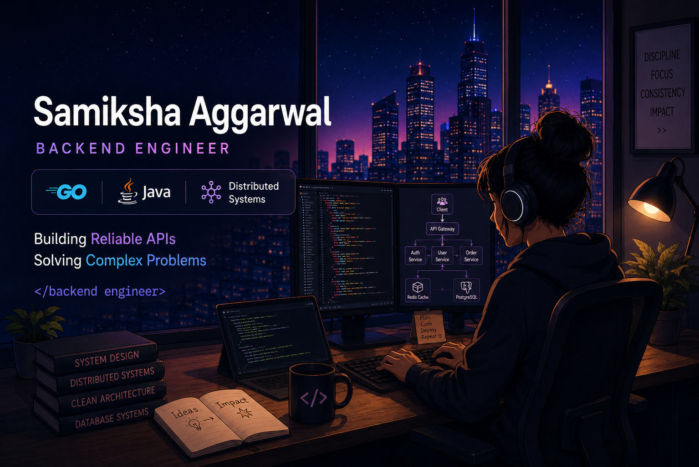

# Samiksha Aggarwal

### Backend Engineer • Golang Developer • Distributed Systems

Building scalable backend systems, designing reliable APIs, and solving complex engineering problems.

---

## 🚀 About Me

- ⚡ Building scalable backend services using **Golang**
- ☕ Solving Data Structures & Algorithms using **Java**
- 🔍 Exploring **System Design, Distributed Systems, and Microservices**
- ☸️ Working with **Docker & Kubernetes**
- 📈 Designing and executing **high-scale load tests using JMeter**
- 🚀 Passionate about building reliable, scalable systems

---
## 🛠️ Languages and Tools

---
## 🧩 Problem Solving

- Solving Data Structures & Algorithms using Java
- Consistent LeetCode practice
- Interested in Low-Level Design and System Design

---

## 🌐 Connect With Me

